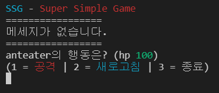

SSG - Super Simple Game
====

## 1. 개요
SSG - Super Simple Game은 CUI 기반의 아주 간단한 온라인 게임입니다.

## 2. 설명
  
처음 SSG를 실행해 이름을 입력하면 서버에 접속할 수 있습니다. 각 유저들은 서버에 접속 시 임의의 아이디를 부여받습니다. 유저 인터페이스에서 공격을 선택하면 서버에 접속 중인 모든 유저들 중 랜덤으로 대상을 선택해 공격합니다. 유저는 행동 마다 자신이 받은 피해를 확인하고, 행동 이후 체력이 모두 떨어진 상태라면 게임이 종료됩니다.

## 3. 알려진 문제
 * 서버에서 보낸 한글 메세지가 깨지는 문제
 * 서버 접속 시 **간헐적으로** 오류가 발생하여 프로그램이 종료되는 문제
 * 무슨 생각으로 이걸 만든건지 모르겠음...

기타 알려지지 않은 오류 발생 시, 포크해서 알아서 고치십시오.